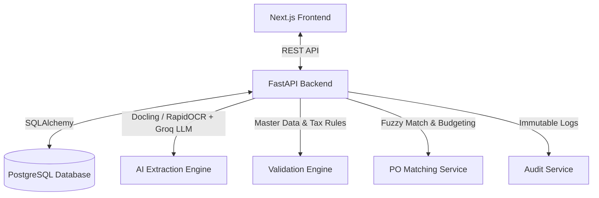

# AP Automation System

[](#technology-stack)
[](#license)

An Accounts Payable (AP) Automation platform engineered to streamline invoice ingestion, perform AI-driven data extraction, validate multi-layered compliance parameters, execute Purchase Order (PO) matching, and manage structured approval workflows.

## Table of Contents
- [System Architecture](#system-architecture)
- [Core Capabilities](#core-capabilities)
- [Technology Stack](#technology-stack)
- [Directory Structure](#directory-structure)
- [Local Deployment](#local-deployment)
- [API Reference](#api-reference)

## System Architecture



## Core Capabilities

- **AI-Powered OCR Extraction:** Utilizes `RapidOCR` and `Docling` document conversion engines combined with the Groq LLM to accurately extract invoice fields from PDFs and image payloads.
- **Multi-Layered Validation Engine:** Evaluates incoming data against foundational rules (dates, numbers), master data constraints (GSTIN format, state code compliance), and tax mathematics (intra-state vs. inter-state tax routing).
- **Entity Resolution & HSN Master:** Automatically resolves buyer/seller names from GSTIN codes and verifies line items against a centralized Harmonized System of Nomenclature (HSN) database.
- **Intelligent PO Matching:** Employs fuzzy name matching, amount tolerance checks, and remaining budget capacity logic to automatically reconcile invoices against open Purchase Orders.
- **Workflow State Machine:** Manages a strict lifecycle (`InvoiceWorkflowStatus`) routing invoices from `validation_failed` and `pending_review` up to final `approved` or `rejected` states, governed by a dedicated reviewer and approver dashboard.
- **Immutable Audit Logging:** Captures all state transitions and field mutations (e.g., `INVOICE_CREATED`, `STATUS_CHANGED`) ensuring a persistent, non-repudiable audit trail.

## Technology Stack

**Backend**
- **Framework:** FastAPI (Python 3.11)
- **Database ORM:** SQLAlchemy + Alembic Migrations
- **AI & OCR:** RapidOCR, Docling, Groq LLM API

**Frontend**
- **Framework:** Next.js 14 (React 18 App Router)
- **Language:** TypeScript
- **Styling:** Tailwind CSS

**Infrastructure**
- **Containerization:** Docker & Docker Compose
- **Database:** PostgreSQL 16 *(Note: Deployment does not include or require pgAdmin)*

## Directory Structure

- `backend/` - Contains the FastAPI application, modular routers, Pydantic schemas, SQLAlchemy models, AI extraction prompt definitions, and Alembic database migrations.
- `frontend/` - Next.js UI application including data tables, dashboard statistics, invoice upload components, and dynamic routing logic.
- `testing/` - Contains comprehensive unit, integration, benchmark, and manual test suites. Organized by tier (`testing/backend/` and `testing/frontend/`).
- `docs/` - Contains system architecture, database design, API specifications, AI/OCR documentation, and operational guides.
- `docker-compose.yml` - Infrastructure orchestration for the database and core services.

## Local Deployment

### Prerequisites
- Docker and Docker Compose
- Python 3.11+ and Node.js 20+ (optional, for local development outside containers)

### Installation Steps

1. **Configure Environment Variables**
   Initialize your environment configuration by copying the example file:
   ```bash
   # Copy example baseline configuration to .env.local for local overrides
   cp .env.example .env.local
   # Ensure you fill in your real secrets (e.g. GEMINI_API_KEY, HF_TOKEN) in .env.local.
   ```

   **Security: Generating a JWT Secret Key**
   All token-based user sessions are secured using JWT tokens. You **must** generate a strong, secure random key for the `JWT_SECRET` variable in your `.env.local` file. 
   
   To generate a secure 32-byte (256-bit) cryptographically strong random hex token, run this command in your terminal:
   ```bash
   python -c "import secrets; print(secrets.token_hex(32))"
   ```
   Copy the output value and set it in `.env.local`:
   ```env
   JWT_SECRET=your_generated_hex_token_here
   ```

2. **Provision Infrastructure**
   Build and launch the application containers in detached mode:
   ```bash
   docker compose up --build -d
   ```

3. **Verify Deployment**
   Access the local instances via:
   - **Frontend Application:** http://localhost:3000
   - **Backend API Documentation:** http://localhost:8000/docs

4. **Database Seeding & Migration**
   Execute the initial schema migrations and seed the database with Organizations, default Users, baseline Purchase Orders, and sample invoices:
   ```bash
   docker compose exec backend python -m app.seed.seed_db
   ```

### Seeded Credentials & Multi-Tenancy

The following tenant-isolated organizations and users can be populated using the database seed command above. The default password for all seeded accounts is `Password123!`.

| User Name | Email Address | Role | Organization |
| :--- | :--- | :--- | :--- |
| **Nithin** | `nithin.super@company.com` | Super Admin | *Global (All Orgs)* |
| **Suprith** | `suprith@beverly.com` | Admin | Beverly |
| **Ranjitha** | `ranjitha@beverly.com` | Reviewer | Beverly |
| **Tharun** | `tharun@beverly.com` | Finance Manager | Beverly |
| **Beverly Auditor** | `auditor@beverly.com` | Auditor | Beverly |
| **Global Admin** | `admin@global.com` | Admin | Global Industries |
| **Innovate Admin** | `admin@innovate.com` | Admin | Innovate LLC |

## API Reference

### Invoice Processing & Extraction

| Method | Endpoint | Description |
| :--- | :--- | :--- |
| `POST` | `/ai/extract` | Accepts a PDF/Image upload, performs OCR, and returns structured JSON via LLM extraction. |
| `POST` | `/invoices/` | Ingests a new invoice, executing the full validation and PO matching pipeline. |
| `GET` | `/invoices/` | Returns a paginated list of ingested invoices. |
| `GET` | `/invoices/{id}` | Retrieves a specific invoice and its associated line items. |
| `PUT` | `/invoices/{id}` | Updates invoice properties and automatically re-triggers validation logic. |

### HSN & Purchase Orders

| Method | Endpoint | Description |
| :--- | :--- | :--- |
| `POST` | `/hsn/bulk` | Bulk upserts HSN master data records for validation checks. |
| `POST` | `/purchase-orders/` | Creates a new Purchase Order in the database. |
| `POST` | `/invoices/{id}/match` | Manually invokes the fuzzy-matching PO engine against an invoice. |

### Workflow Management

| Method | Endpoint | Description |
| :--- | :--- | :--- |
| `GET` | `/invoices/reviewer-queue` | Retrieves invoices flagged as `validation_failed` or `pending_review`. |
| `POST` | `/invoices/{id}/submit-for-approval`| Submits a remediated invoice for final management approval. |
| `GET` | `/invoices/approver-queue` | Retrieves verified invoices awaiting an approver decision. |
| `POST` | `/invoices/{id}/approve` | Commits the invoice workflow state to `approved`. |

---

## License

Distributed under the MIT License. See the `LICENSE` file for more information.
